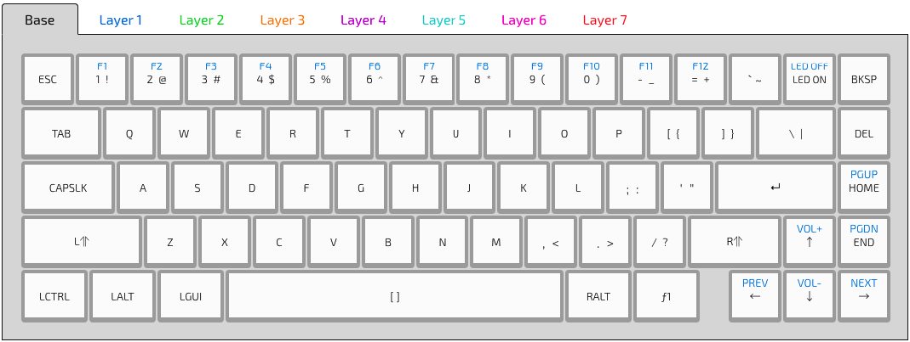

# whitefox
Configuration files for my [Whitefox](https://input.club/whitefox/) (True Fox layout)



## Setup

- Download the following packages via homebrew

```
$ brew tap caskroom/drivers
$ brew cask install kiibohd-configurator
```

**Note:** This will automatically install the `dfu-util` dependency

- Launch the configurator

`Kiibohd Configurator`

## Flashing

Once you are ready to flash your image to your keyboard.

- Put the keyboard in Flash mode. (click with a paper clip in the back of the keyboard).

Run the following command.

```
$ dfu-util -D ./bin/kiibohd.dfu.bin
```

**Enjoy your Whitefox**
